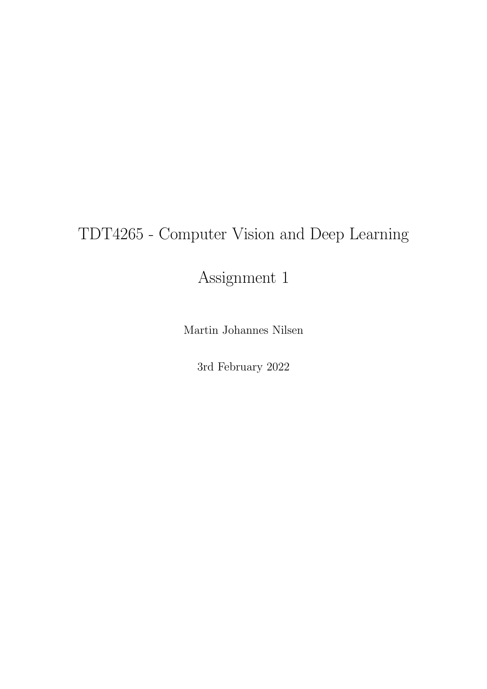
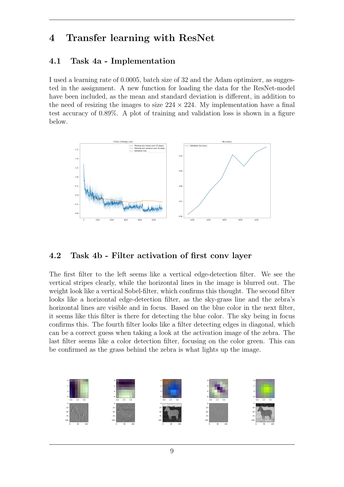
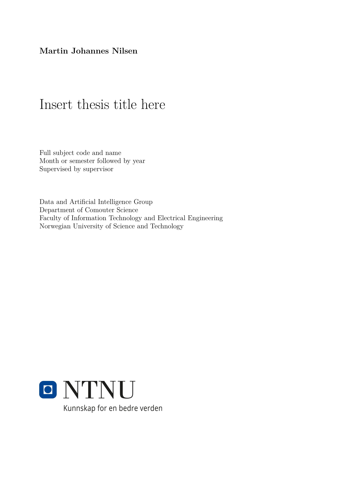
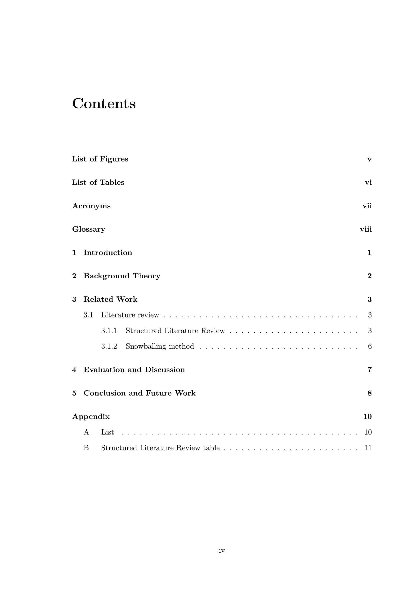
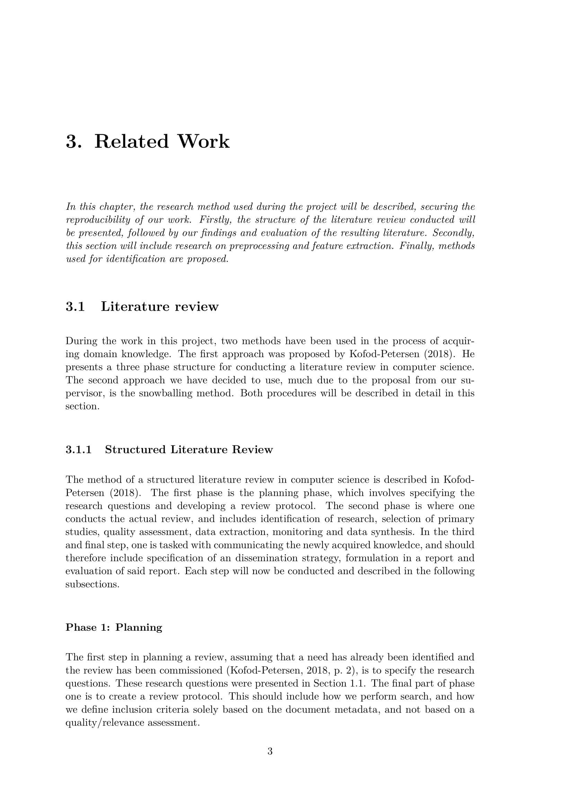

# SetupLaTeX

A command line interface for setting up LaTeX reports in no time. The provided templates offer an easy to use structure, examples of how to write and referencing using BibTeX among other features. This enables you to focus more on writing your report, and less time used on configuring LaTeX.

---

## How to get started

By downloading the project as a zip-file or cloning the repository, you can proceed to run

`pip install -r requirements.txt` 

for installing the required Python modules.

---

## Usage

Being a command line interface program, the usage should be quite intuitive to get started with. Simply open a terminal, and run the script `setuplatex`.

```
> setuplatex --help
Usage: setuplatex [OPTIONS]

  A command line interface for setting up LaTeX reports in no time.

Options:
  -t, --template          Select which template to use.
  -p, --path TEXT         Set output directory. Defaults to cwd.
  --subject TEXT          Insert subject (if report).
  --title TEXT            Insert title (if report).
  --author TEXT           Insert author (if report).
  --date TEXT             Insert date (if report).
  --set-default-author    Set default author.
  --set-default-template  Set default template.
  --show-default-configs  Show default configurations.
  --help                  Show this message and exit.
```

<details>
<summary>How to add as executable</summary>
</br>
Step 1. The included shebang (first line telling OS which interpreter to use) removes the need for the file extension `.py`</br>
Step 2, option 1. Proceed to mark it as an executable, add it to path and the script will be available from any directories.

For more information, and other solutions, you can read this post on [StackOverflow](https://stackoverflow.com/questions/27494758/how-do-i-make-a-python-script-executable/27494871)</br>
Step 2, option 2. You may also use aliases for the same purpose: `alias setuplatex="python3 ./path/to/setupLatex"`</br>


If you do not want the hassle of adding the program to your system for universal use, you can always run the file from the correct directory, and send in the destination path as an argument.</br>

</details>

---

## Templates

<details>
<summary>How to use template</summary>
</br>

By running `setuplatex --template`, you will get the option of selecting from the provided templates.

If you want to change the default template, simply run `setuplatex --set-default-template`
</br>

</details>


### Assignment report (default)

<p float="left">
  
   
  
</p>

A simple sectionbased report, created for university assignments, but with a ton of other use-cases.

The template provides:

* A clean title page
* Easy insertion of figures, tables, equations, algorithms and code listings
* A well structured and commented configuration-file (`setup.sty`)
* Support for (commented out):
  * Bibliography using BibTeX, formatting both in-text referencing and the reference list for you
  * Appendices
  * List of tables and figures


### Thesis

<p float="left">
  
   
  
</p>


A LaTeX template for larger articles, with a structure of both chapters and sections, included bibliography, glossaries and appendices, in a two side format for printability.

The template provides:

* A clean title page
* Easy insertion of figures, tables, equations, algorithms and code listings
* A well structured and commented configuration-file (`setup.sty`)
* Bibliography using BibTeX, formatting both in-text referencing and the reference list for you
* Glossaries, Appendices and list of figures/tables

---

If you were to find bugs in the code, feel free to create a PR, add an issue or send it to me on [mail](mailto:martinjnilsen@icloud.com?subject=[GitHub]%20SetupLaTeX).

Licence: [MIT](LICENSE)
